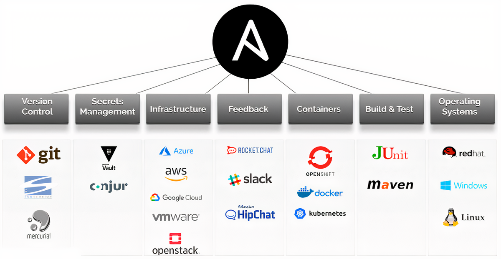

Ansible Repo
=========



About Ansible
=============

Ansible is an open-source automation tool that helps you manage and configure your IT infrastructure. 

Think of it as a way to automate repetitive tasks like setting up servers, deploying applications, and managing network devices.

Here are some key points about Ansible:

Simple Language: Ansible uses YAML, a human-readable language, to write scripts called playbooks.

Agentless: You don’t need to install any software on the machines you’re managing. Ansible uses SSH to communicate with them.

Idempotent: It ensures that running the same script multiple times won’t change the system if it’s already in the desired state.

Install and manage your Vaultwarden instances using Ansible.

Installation 
------------
Additional Step for Windows
1. Enable Linux Subsystem
```
Control Panel > Windows turn On and Off > Linux Subsystem
```
2. Install WSL over Linux
```
wsl -l -o 
```
```
wsl - - install -d Ubuntu-22.04
```
3. Login Linux and follow below command
```
sudo apt install software-properties-common
```
```
sudo add-apt-repository --yes --update ppa:ansible/ansible
```
```
sudo apt install ansible
```
4. Verify ansible version
```
ansible --version
```

Author Information
=======
Anoop Maurya

Version 1